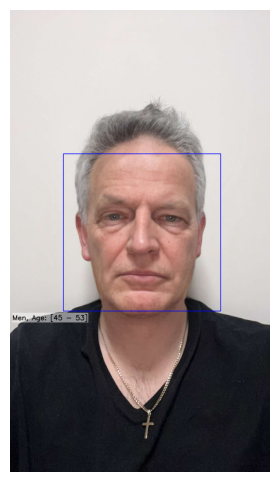

# Age Estimation from Facial Images Without Neural Networks

## Overview

This project explores an **alternative approach to age estimation**, relying on **classical machine learning techniques** rather than deep neural networks. The method extracts **texture-based features** from facial images and classifies them into predefined age groups. The goal is to create an interpretable and efficient model that can estimate age from a face image with high accuracy.

## Methodology

### 1. **Face Detection**

- The system first detects faces using **Haar Cascade Classifiers**, a classical approach for object detection.
- Detected faces are extracted and resized to a standard **256×256 pixels** for consistency.

#### Example Face Detection

### 2. **Feature Extraction Using LBP (Local Binary Patterns)**

- LBP is used to capture **texture features** from the face.

- Each facial image is divided into **three color channels (RGB)** and further split into **16 subregions per channel**.

- For each subregion, a **histogram of LBP values** is generated, resulting in a **feature vector of length 12,288** per image.

### 3. **Dimensionality Reduction with PCA**

- The high-dimensional LBP feature vector is reduced using **Principal Component Analysis (PCA)**.
- PCA preserves **95% of the variance**, reducing the dimensionality while keeping the most informative features.
- The final representation has **171 features for men** and **182 for women**.

### 4. **Age Classification Using SVM**

- A **Support Vector Machine (SVM) classifier** is trained to predict age groups.
- The classifier is trained separately for **male and female faces**.
- The following parameters are used for the SVM:
  - **Kernel:** Radial Basis Function (RBF)
  - **Regularization (C):** 10
  - **Gamma:** Scale
  - **Probability Estimates:** Enabled

#### Example Age Classification

  
  
  
  

  

  
  
  

## My Accuracy Metric
To better evaluate the model's performance, a custom metric called **My Accuracy** is introduced. This metric gives partial credit to predictions that are close to the correct age group, reflecting the practical impact of small classification errors.

The formula for **My Accuracy** is:

$$
\text{My Accuracy} = \frac{\text{correctly classified samples} + 0.5 \times \text{minor mistakes}}{\text{total number of samples}}
$$

Where:
- **Correctly classified samples** are those predicted in the correct age group.
- **Minor mistakes** are predictions that fall into adjacent age groups, given half the weight of correct classifications.
- **Total number of samples** is the total count of tested images.

This metric provides a more nuanced evaluation, ensuring that slight misclassifications do not overly penalize the model.

## Dataset

- The model is trained on the **UTKFace dataset**, which contains over **20,000 images** of faces with age labels.
- For this project, only **Caucasian subjects** are included, and the dataset is split into predefined **age groups:**
  - **0-6, 7-17, 18-28, 29-35, 36-44, 45-53, 54-62, 63+**

## Results

- The method achieves **high interpretability**, allowing identification of key facial features influencing age prediction. 
- **Wrinkles and hair color** (graying) were identified as major factors in older age groups.
  

  
  
  

  

  
  
  

- The classifier **performs well on high-resolution images**, but struggles with low-resolution or grayscale images.
  

#### Example Results

  

  
  
  

  

  
  

 

## Strengths & Limitations

### ✅ Strengths:

- **Explainability:** Key facial features influencing classification are interpretable.
- **Efficiency:** Faster than deep learning models, as it does not require GPU-intensive training.
- **Generalization:** Works well for the selected dataset and can be adapted to other datasets.

## Future Improvements

- **Experiment with additional feature extraction techniques**, such as **Histogram of Oriented Gradients (HOG)**.
- **Extend the model to different ethnic groups** for better generalization.
- **Explore hybrid approaches combining classical ML with CNNs** to improve performance.

## Acknowledgments

This project utilizes **scikit-learn, OpenCV, NumPy, and matplotlib** for data processing and visualization.

---

**Author:** Włostek Piotr
**Date:** December 2024

